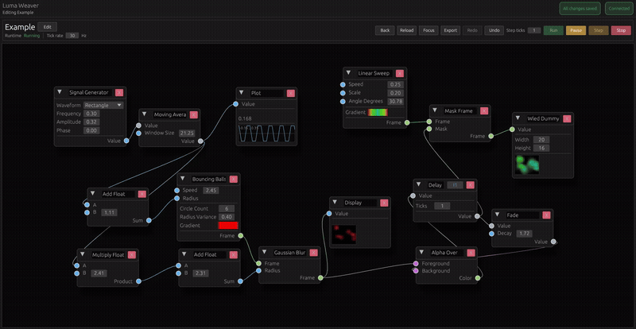

# Luma Weaver

<p align="center">
  
</p>

Luma Weaver is a node-based lighting and animation editor built with Rust. It combines a browser-hosted `egui` frontend compiled to WebAssembly with an Axum backend that stores graph documents, executes them in real time, and serves the UI from the same process.

<p align="center">
  
</p>

The project is designed for two main deployment styles:

- standalone, using Docker or Docker Compose
- as a Home Assistant add-on

It is especially aimed at reactive and programmable LED workflows, with built-in support for WLED discovery/output and Home Assistant MQTT number entities.

## What it does

With Luma Weaver, you can build animation graphs from reusable nodes and run them continuously on the backend. Nodes expose inputs and parameters, so animations can be tuned precisely to your own preferences instead of being locked to fixed presets.

Current building blocks in the repository include:

- animation and pattern nodes such as linear sweep, circle sweep, plasma, twinkle stars, bouncing balls, and level bar
- math and signal nodes such as constants, add/subtract/multiply/divide, min/max/clamp, abs, map range, power/root/exp/log, rounding, and signal generator
- frame and color processing nodes such as tint, mix, blur, mask, brightness, and filters
- runtime/debug nodes such as plot, display, and a WLED dummy display
- network nodes for WLED output, WLED frame input, audio FFT receive, and Home Assistant MQTT numbers

Graph documents are persisted on disk, runtime status is restored on restart, and the frontend communicates with the backend over WebSocket.

## Basic Architecture

The workspace is split into three crates:

- `crates/frontend`: the browser UI, built with `eframe`/`egui` and compiled to WebAssembly with `trunk`
- `crates/backend`: the HTTP/WebSocket server, graph storage, graph runtime, WLED discovery, and MQTT/Home Assistant integration
- `crates/shared`: shared protocol types, graph schema, validation, and built-in node definitions used by both frontend and backend

At runtime, the flow looks like this:

1. The browser loads the WebAssembly frontend from the backend.
2. The frontend opens a WebSocket connection to `/ws`.
3. The backend loads stored graph documents and running-state metadata from disk.
4. Graphs are compiled into executable runtime tasks and ticked at their configured frequency.
5. Runtime outputs can be sent to integrations like WLED or exposed through Home Assistant MQTT entities.

Important backend endpoints:

- `/`: serves the frontend bundle
- `/ws`: frontend/backend messaging
- `/health`: health check endpoint for containers and add-on watchdogs

## Repository Layout

- `crates/frontend`: WebAssembly app and editor UI
- `crates/backend`: backend server, storage, runtime, MQTT, and WLED services
- `crates/shared`: graph model, protocol types, validation, and node catalog
- `docs`: audience-based documentation for users and contributors
- `Dockerfile`: multi-stage build for standalone Docker and Home Assistant add-on builds
- `docker-compose.yml`: simple standalone deployment example
- `config.yaml`, `build.yaml`, `repository.yaml`: Home Assistant add-on metadata

## Documentation

Longer-form documentation lives under `docs/`.

- `docs/index.md`: documentation landing page
- `docs/user/README.md`: user docs entry point
- `docs/developer/architecture.md`: workspace and runtime architecture
- `docs/developer/node-authoring.md`: how built-in nodes are added and changed
- `docs/developer/contributing.md`: contributor workflow

## Running Standalone

### With Docker Compose

The quickest standalone path is:

```bash
docker compose up --build
```

That starts the backend and exposes the UI on:

```text
http://localhost:38123/
```

The compose setup persists application data in a named Docker volume mounted at `/app/data`.

### With Docker

Build the image:

```bash
docker build -t luma-weaver .
```

Run it:

```bash
docker run --rm -p 38123:38123 -v luma-weaver-data:/app/data luma-weaver
```

Useful environment variables:

- `APP_DATA_DIR`: directory for persisted graphs, MQTT broker configs, and runtime state
- `FRONTEND_DIST_DIR`: location of the compiled frontend assets inside the container
- `BACKEND_PORT`: HTTP/WebSocket server port, default `38123`
- `RUST_LOG`: backend log level, for example `info` or `debug`

Notes:

- The backend serves the frontend bundle itself, so you only need one container.
- Host networking can be useful if you rely on LAN discovery features such as mDNS-based WLED discovery.

## Home Assistant Add-on

This repository can also be installed as a custom Home Assistant add-on repository.

### Add the repository

In Home Assistant:

1. Open `Settings -> Add-ons -> Add-on Store`.
2. Open the repositories menu.
3. Add this repository URL:

```text
https://github.com/Hannes-Beckmann/luma-weaver
```

### Install the add-on

After adding the repository:

1. Install the `Luma Weaver` add-on.
2. Start it.
3. Open the web UI from Home Assistant or directly at port `38123`.

Because `config.yaml` now includes an `image` reference, Home Assistant will pull a prebuilt container image from GHCR instead of compiling the add-on on the target machine.

The add-on is configured to:

- run on the host network
- expose the web UI on port `38123`
- persist runtime data in Home Assistant's `/data` volume
- use `/health` as the watchdog endpoint

That makes Home Assistant a convenient host for always-on use while still keeping the app itself independent and browser-based.

### Publishing add-on images

To make the add-on install without compiling on the Home Assistant host:

1. Update the version in `config.yaml`.
2. Create and push a matching Git tag in the form `vX.Y.Z`.
3. Let GitHub Actions publish the release image.

The repository includes `.github/workflows/publish-addon.yml`, which publishes one multi-arch image:

- `ghcr.io/hannes-beckmann/luma-weaver-addon:<version>`
- `ghcr.io/hannes-beckmann/luma-weaver-addon:latest`

Home Assistant and standalone Docker both use the same image name, and Docker selects the right `amd64` or `aarch64` variant automatically from the manifest list.
The same tag also creates a GitHub Release with automatically generated release notes.

## Development

Inside a development environment with Rust, the wasm target, and `trunk` available:

```bash
cargo check
cd crates/frontend && trunk build --release
cargo run -p backend
```

Then open:

```text
http://localhost:38123/
```

By default, the backend reads and writes runtime data from `crates/backend/data` when `APP_DATA_DIR` is not set.

## Persistence Model

Luma Weaver stores runtime data on disk. This includes:

- graph documents
- MQTT broker configuration
- the set of graphs that should resume in the running state on restart

In standalone Docker, this should be backed by a volume. In Home Assistant, it is stored in the add-on data directory.

## Integrations

### WLED

The backend includes mDNS-based WLED discovery and output support. Discovered devices are tracked by the backend and published to the frontend so they can be selected in graph nodes.

### Home Assistant MQTT

Luma Weaver can expose values through Home Assistant MQTT `number` entities. The backend manages broker connections, discovery payloads, command/state topics, and value synchronization for registered graph nodes.

Reusable broker configs can be marked as Home Assistant brokers in the UI. Only marked brokers are offered to Home Assistant nodes, while unmarked configs remain stored for future generic MQTT use.

## Status

The project already contains a substantial runtime and node catalog, but it is still best understood as an actively evolving tool. If you deploy it, expect the graph format, node set, and integrations to continue growing.


