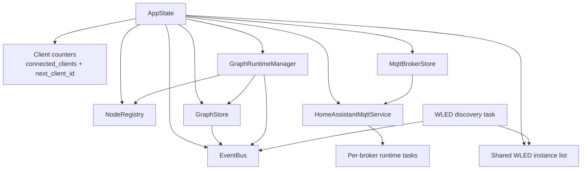
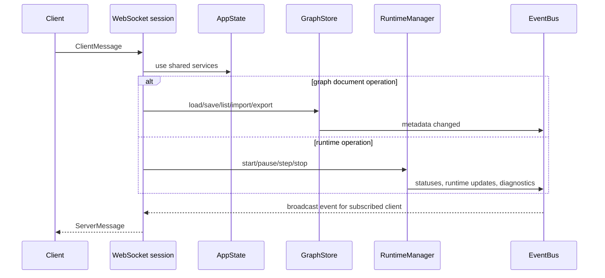

# Backend Objects

This page describes the main long-lived backend objects in Luma Weaver, what each one owns, and how they interact.

If [architecture.md](architecture.md) explains the backend at module level, this page explains it at object level.

Use this page when you want to understand ownership and service relationships inside the backend process.

- For crate/module layout, see [architecture.md](architecture.md).
- For protocol and transport flow, see [protocol-runtime.md](protocol-runtime.md).
- For graph compilation and tick execution flow, see [runtime-execution.md](runtime-execution.md).

## Startup Root

The backend object graph is assembled in:

- `crates/backend/src/app/startup.rs`

Startup builds the shared `AppState` that is later passed into the HTTP and WebSocket layers.

The important objects created there are:

- `EventBus`
- `NodeRegistry`
- `GraphStore`
- `MqttBrokerStore`
- `HomeAssistantMqttService`
- `GraphRuntimeManager`
- shared `wled_instances`
- client counters used by WebSocket sessions

## AppState

The central shared object is `AppState` in:

- `crates/backend/src/app/state.rs`

`AppState` is cloned into Axum handlers and gives them access to the backend's long-lived services.

It contains:

- `connected_clients`
- `next_client_id`
- `event_bus`
- `node_registry`
- `graph_store`
- `mqtt_broker_store`
- `mqtt_service`
- `runtime_manager`
- `wled_instances`

Conceptually, `AppState` is the process-wide service container for the backend.

## Object Relationship Diagram

## EventBus

The event bus lives in:

- `crates/backend/src/messaging/event_bus.rs`

`EventBus` has two jobs:

1. broadcast backend events to interested WebSocket sessions
2. keep a persistent in-memory diagnostic store keyed by graph and node

It publishes events such as:

- generic event messages
- graph metadata changes
- runtime status changes
- node runtime updates
- graph diagnostics summary changes
- node diagnostics detail changes
- WLED instance changes

It also implements:

- `GraphStoreEventPublisher`
- `RuntimeEventPublisher`

That means both the graph store and the runtime manager can report changes without depending directly on WebSocket code.

## NodeRegistry

The node registry is built once at startup and shared through `Arc`.

It is the runtime/schema lookup object for the shared node catalog. Other backend objects use it to:

- resolve node definitions
- create runtime evaluators
- ask for construction diagnostics

The runtime compiler and manager depend on it heavily.

## GraphStore

The graph store lives in:

- `crates/backend/src/services/graph_store/mod.rs`

It is responsible for persisted graph documents under the backend data directory.

Main responsibilities:

- create graph documents
- delete graph documents
- list graph metadata
- load graph documents
- save graph documents
- import and export graph exchange files
- update graph metadata such as name and execution frequency

Important implementation detail:

- the store serializes access with an internal `Mutex`
- metadata changes are emitted through the `GraphStoreEventPublisher` interface

In production, that publisher is the `EventBus`.

## MqttBrokerStore

The MQTT broker store lives in:

- `crates/backend/src/services/mqtt_broker_store/mod.rs`

It is a simple persistence object for reusable `MqttBrokerConfig` entries.

Main responsibilities:

- load all saved broker configs
- save the full broker list

Unlike `GraphStore`, it does not itself broadcast domain events. It is used by higher-level code that decides what to do after broker configs change.

## HomeAssistantMqttService

The Home Assistant MQTT service lives in:

- `crates/backend/src/services/mqtt/mod.rs`

This is the process-wide runtime service for Home Assistant MQTT behavior.

Main responsibilities:

- keep the configured broker set in memory
- spawn and stop per-broker runtime tasks
- expose graph-backed MQTT number entities
- publish discovery payloads
- mirror command/state messages
- track broker connection state and entity state

Important object model:

- one `HomeAssistantMqttService` per process
- zero or more `BrokerHandle`s, one per active Home Assistant broker
- one broker task per active Home Assistant broker
- per-broker runtime state containing connection state and registered entities

The service is also registered globally so runtime nodes can access it while evaluating graphs.

## GraphRuntimeManager

The runtime manager lives in:

- `crates/backend/src/services/runtime/manager.rs`

This is the long-lived coordinator for active graph runtime tasks.

Main responsibilities:

- restore persisted running graphs on startup
- compile graphs before execution
- spawn one async execution task per active graph
- send `Start`, `Pause`, `Step`, and `Stop` commands
- persist the set of running graph IDs
- publish `RuntimeStatuses`
- emit startup and construction diagnostics

Important dependencies:

- `GraphStore` for loading documents
- `NodeRegistry` for compilation
- `EventBus` through `RuntimeEventPublisher`

Each managed graph task owns:

- a `CompiledGraph`
- a `GraphExecutionState`
- a runtime mode
- a stop channel
- a command channel

## Shared WLED Instance List

WLED discovery keeps a shared `Arc<RwLock<Vec<WledInstance>>>` in `AppState`.

This object is:

- updated by the blocking discovery task
- read by request handlers and WebSocket routing
- mirrored to the frontend through event-bus notifications

It is intentionally a simple shared cache rather than a larger service object.

## HTTP Layer

The HTTP router is built in:

- `crates/backend/src/api/http.rs`

The router owns no domain state itself. It receives `AppState` and exposes:

- `/health`
- `/ws`
- static frontend asset serving

So the HTTP layer is mostly a transport shell around the shared backend objects.

## WebSocket Layer

The WebSocket layer lives under:

- `crates/backend/src/api/websocket/...`

Its job is to translate between protocol messages and backend services.

Main responsibilities:

- manage per-client session lifecycle
- parse `ClientMessage`
- route commands to graph store, runtime manager, integrations, or event subscriptions
- serialize `ServerMessage`
- subscribe to the `EventBus` and fan out relevant updates to one client

Important point:

- WebSocket sessions are per-client objects
- the domain services in `AppState` are shared process-wide objects

## WLED Discovery Task

WLED discovery lives in:

- `crates/backend/src/services/wled/discovery.rs`

It is started once at backend startup.

Main responsibilities:

- browse `_wled._tcp.local.`
- maintain a discovered-device map
- opportunistically fetch LED counts over HTTP
- update the shared WLED instance list
- emit `WledInstancesChanged` through the event bus

This is one of the clearest examples of an autonomous backend task that feeds shared state plus event notifications.

## Interaction Flow

## A Useful Mental Model

The backend is easiest to reason about if you separate objects into three groups.

### Shared domain services

- `GraphStore`
- `MqttBrokerStore`
- `HomeAssistantMqttService`
- `GraphRuntimeManager`
- `NodeRegistry`

These hold the real application behavior.

### Shared coordination and cache objects

- `EventBus`
- shared `wled_instances`
- client counters

These connect services, sessions, and background tasks together.

### Transport/session layer

- Axum HTTP router
- WebSocket session handlers

These adapt the outside world to the shared service graph in `AppState`.

## When To Update This Page

This page should be revisited when:

- a new long-lived backend service is introduced
- ownership moves between services
- startup wiring changes materially
- new background tasks are added
- AppState fields are added or removed

## Related Pages

- [architecture.md](architecture.md)
- [protocol-runtime.md](protocol-runtime.md)
- [runtime-execution.md](runtime-execution.md)
- [workflows.md](workflows.md)
