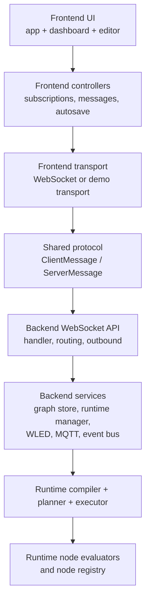
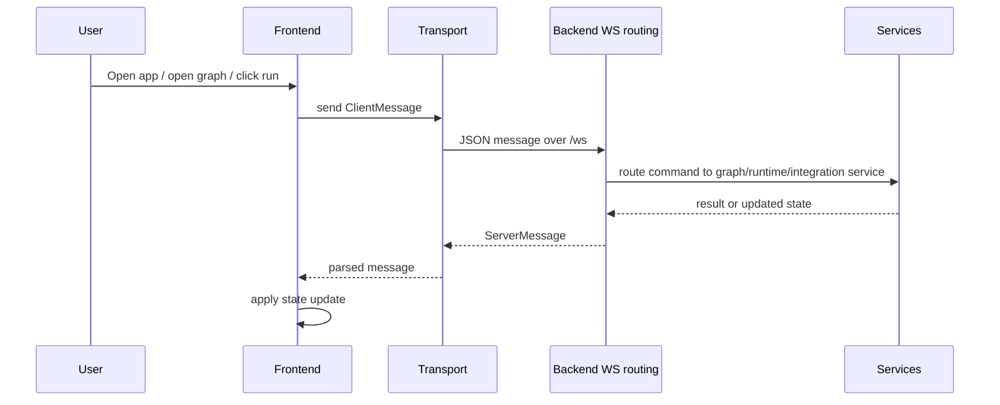

# Protocol And Runtime Internals

This page describes the internal frontend/backend message flow used by Luma Weaver.

It is aimed at contributors who need to understand how frontend state, transport behavior, subscriptions, and backend message routing fit together.

Use this page for protocol-facing behavior:

- protocol message flow
- frontend/backend synchronization
- subscription behavior
- backend WebSocket routing
- runtime-update transport

For crate/module layout, see [architecture.md](architecture.md). For long-lived backend service ownership, see [backend-objects.md](backend-objects.md). For compilation and execution behavior, see [runtime-execution.md](runtime-execution.md).

## Scope

The main code touchpoints for this page are:

- `crates/shared/src/protocol.rs`
- `crates/backend/src/api/websocket/...`
- `crates/backend/src/services/runtime/...`
- `crates/frontend/src/controllers/...`
- `crates/frontend/src/transport.rs`

## Layered View

## Transport Shape

The normal application flow is backend-hosted:

- the frontend is served by the backend
- the frontend connects to `/ws`
- the transport carries `ClientMessage` and `ServerMessage`
- runtime updates and diagnostics come from backend services

There is also a GitHub Pages-specific variant:

- the frontend is served as a static bundle
- the frontend uses an in-browser demo transport instead of `/ws`
- the same logical protocol types are reused
- a portable runtime subset executes in the browser

This exists so the Pages preview can stay close to the real app without becoming the main deployment model described by the docs.

## Structured Protocol

The shared protocol in [protocol.rs](c:/Users/Hannes/repos/luma-weaver.worktrees/hermann/crates/shared/src/protocol.rs) is centered around two tagged enums:

- `ClientMessage`: requests and commands sent by the frontend
- `ServerMessage`: responses, snapshots, and streamed updates sent back to the frontend

Important `ClientMessage` groups:

- connection and identity: `Ping`, `SetName`
- generic event subscriptions: `Subscribe`, `Unsubscribe`
- graph document lifecycle: create, delete, load, update, import, export, rename
- runtime control: start, pause, step, stop, get statuses
- graph-scoped subscriptions: runtime updates and diagnostics
- integration queries: WLED instances and MQTT broker configs

Important `ServerMessage` groups:

- connection and status: `Welcome`, `State`, `Pong`, `Error`
- snapshots: `GraphMetadata`, `NodeDefinitions`, `RuntimeStatuses`, `MqttBrokerConfigs`, `WledInstances`
- document exchange: `GraphDocument`, `GraphExport`, `GraphImported`
- streaming updates: `Event`, `NodeRuntimeUpdate`, `GraphDiagnosticsSummary`, `NodeDiagnosticsDetail`

## Frontend Startup And Synchronization

The frontend repeatedly reconciles desired state from the current UI rather than issuing one giant startup handshake.

The key frontend pieces are:

- `crates/frontend/src/controllers/subscriptions.rs`
- `crates/frontend/src/controllers/messages.rs`
- `crates/frontend/src/app/...`

The main loop does roughly this:

1. sync state from browser path
2. maintain the transport connection
3. pump transport I/O
4. request initial snapshots if needed
5. reconcile graph-scoped subscriptions
6. drain incoming server messages into app state

That repeated reconciliation approach is why the frontend can recover after reconnects or view changes without needing a separate one-shot bootstrap state machine.

## Frontend To Backend Flow

## Event Subscriptions Vs Graph-Scoped Subscriptions

There are two related subscription models.

### Generic event subscriptions

These use `EventSubscription` through:

- `ClientMessage::Subscribe`
- `ClientMessage::Unsubscribe`
- `ServerMessage::Event`

They are suited for broader event-bus style updates.

### Graph-scoped runtime and diagnostics subscriptions

These use dedicated protocol messages:

- `SubscribeGraphRuntime`
- `SubscribeGraphDiagnostics`
- `SubscribeNodeDiagnostics`
- matching unsubscribe variants

The frontend keeps:

- one runtime stream for the currently open editor graph
- graph diagnostics subscriptions for all known graphs so the dashboard can show issues
- at most one detailed node-diagnostics subscription for the open diagnostics window

That split keeps the editor responsive without subscribing every graph to high-frequency runtime values.

## Runtime Update Flow

Runtime values are emitted as `NodeRuntimeValue` and turned into `ServerMessage::NodeRuntimeUpdate`.

The executor filters updates against the node's allowed runtime-update schema and rate-limits them per `(node, context)` so high-frequency nodes do not flood the UI.

For large frame payloads, `protocol.rs` also defines a compact binary frame transport:

- `BinaryRuntimeFrameMessage`

That path exists so large `ColorFrame` payloads do not have to travel exclusively through the JSON message path.

## Backend WebSocket Routing

The backend WebSocket layer is split into:

- `handler`: upgrade and connection setup
- `routing`: parse and dispatch incoming `ClientMessage`s
- `outbound`: serialize and send outgoing messages, including optimized runtime-update transport

Routing itself is further split into domain-oriented modules such as:

- graph document routing
- runtime routing
- diagnostics routing
- integrations routing
- session routing

This keeps the transport boundary stable while letting backend services evolve independently.

## Important Contributor Heuristics

When changing internals, these are good questions to ask:

- Is this a protocol contract change or only an internal behavior change?
- Does the frontend subscription model still match the data rate and scope we want?
- Does this affect persisted graph compatibility or only runtime behavior?
- Should a failure be exposed as diagnostics, as an error response, or both?
- Does the GitHub Pages preview need corresponding behavior for consistency?

## Related Pages

- [architecture.md](architecture.md)
- [runtime-execution.md](runtime-execution.md)
- [workflows.md](workflows.md)
- [node-authoring.md](node-authoring.md)
