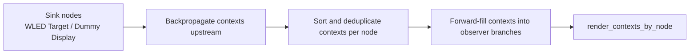
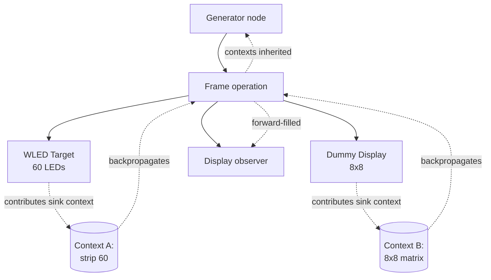
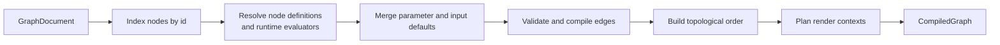
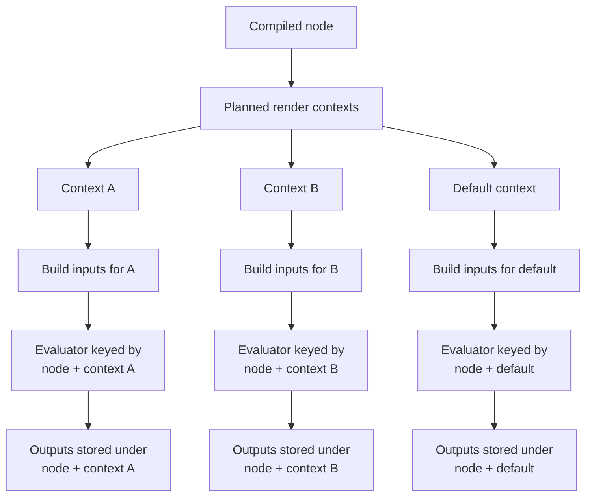
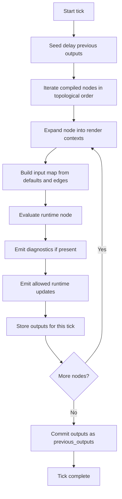
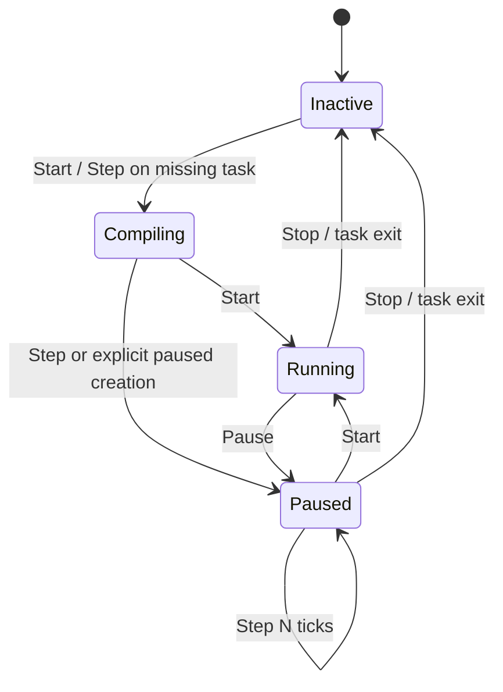

# Runtime Execution Internals

This page describes how Luma Weaver compiles graph documents and executes them at runtime.

It is aimed at contributors who need to understand graph compilation, render-context planning, tick-time execution, and runtime task management.

Use this page for execution-facing behavior:

- graph compilation
- delay edges and feedback handling
- render-context planning
- multi-layout execution
- runtime manager behavior
- diagnostics and runtime update flow

For crate/module layout, see [architecture.md](architecture.md). For protocol and transport behavior, see [protocol-runtime.md](protocol-runtime.md). For long-lived backend service ownership, see [backend-objects.md](backend-objects.md).

## Scope

The main code touchpoints for this page are:

- `crates/backend/src/services/runtime/compiler.rs`
- `crates/backend/src/services/runtime/planner.rs`
- `crates/backend/src/services/runtime/executor.rs`
- `crates/backend/src/services/runtime/manager.rs`
- `crates/backend/src/services/runtime/types.rs`

## Runtime Compilation Model

Graph documents are compiled before they can be executed.

The main entrypoint is:

- `crates/backend/src/services/runtime/compiler.rs`

Compilation does several jobs:

1. index graph nodes
2. resolve node definitions from the registry
3. merge explicit parameter values with schema defaults
4. merge explicit input values with default inputs
5. validate compatible edges
6. build incoming-edge structures for each node
7. compute topological execution order
8. plan render contexts for frame-producing branches
9. collect construction diagnostics

The compiled output is `CompiledGraph`, which contains:

- graph identity and execution frequency
- compiled nodes
- validated incoming edges
- execution order
- render contexts
- a reference to the node registry

## What Compilation Produces

Compilation turns an editable `GraphDocument` into a runtime-oriented structure that no longer needs to do schema lookups on every tick.

Important compiled pieces:

- `CompiledNode`
  - stable node id
  - node type id
  - merged input defaults
  - merged parameters
  - construction diagnostics
  - allowed runtime update names
- `CompiledIncomingEdge`
  - source node index
  - source output name
  - destination input name
  - whether the edge should read from the previous tick
- `CompiledGraph`
  - graph identity and tick frequency
  - compiled nodes
  - incoming edges by node
  - topological order
  - render contexts by node

That means execution can mostly operate on indexes, cached evaluators, and prepared input maps rather than repeatedly walking the persisted graph shape.

## Delay Edges And Feedback

One important compile-time rule is that delay edges are treated differently from normal edges.

When an incoming edge originates from a delay node:

- it is still recorded as an incoming edge
- but it is excluded from the main dependency graph used for topological ordering
- and it is marked to read from `previous_outputs` during execution

This is what allows a graph to express feedback-like behavior without making the whole graph fail topological sorting.

Without that special handling, any feedback loop using a delay node would look like a normal cycle and fail compilation.

## Compiled Runtime State

The long-lived per-graph mutable execution state is `GraphExecutionState` in `types.rs`.

It stores:

- evaluator instances keyed by `(node_index, context_id)`
- previous outputs keyed by `(node_index, context_id, output_name)`
- last runtime-update emission times keyed by `(node_index, context_id)`

That means the runtime reuses node evaluators across ticks instead of rebuilding them every frame.

## Render Context Planning

Frame-producing graphs are not evaluated only once globally. They can be evaluated under concrete render layouts derived from sink nodes such as WLED targets and dummy displays.

This planning happens in:

- `crates/backend/src/services/runtime/planner.rs`

The planner:

- propagates render contexts backward from sink nodes
- deduplicates contexts per node
- forward-fills contexts into observer-style branches that were not reached by the backward pass

This is how upstream render nodes learn the layout they should produce for.

## Multiple LED Layouts In One Graph

One graph can target multiple concrete LED layouts at the same time.

For example:

- one branch might end in a `WLED Target` configured for 60 LEDs
- another branch might end in a `WLED Dummy Display` configured as an `8 x 8` matrix

Those two sinks imply different render contexts:

- a strip-like layout
- a matrix-like layout

Upstream frame-generating nodes may therefore need to be evaluated more than once per tick, once for each context they participate in.

That is why render contexts exist at all: they let one graph support more than one concrete output layout without forcing the entire graph into a single global frame shape.

## Sink Backpropagation

The first step in context planning is backpropagation from sink nodes.

Each sink node contributes a concrete `RenderContext`:

- `WLED Target` creates a context based on its configured target and LED count
- `WLED Dummy Display` creates a context based on its configured width and height

That context is then propagated backward through upstream dependencies.

Important consequence:

- a node can accumulate multiple contexts if it contributes to multiple sinks

So if one animation branch feeds two different sinks, the upstream generator may be evaluated once per sink context.

## Forward Fill For Observer Branches

Backpropagation alone is not enough.

Some nodes, especially observer-style or debug-style nodes, may inspect a render-producing branch without themselves leading to a sink. In those cases, the planner does a second pass that forward-fills contexts from upstream nodes into branches that were not assigned a context during sink backpropagation.

This is what allows nodes like displays or previews to stay aligned with the render-producing branch they are inspecting.

## Render Context Planning Flow

## Multi-Layout Example

In that example:

- `GEN` may be evaluated twice, once for the strip context and once for the matrix context
- `DISPLAY` can inherit a context even though it is not itself a sink
- one graph therefore supports more than one concrete LED layout at execution time

## Compilation Pipeline

## Tick-Time Execution Model

Tick execution happens in:

- `crates/backend/src/services/runtime/executor.rs`

For each tick, the runtime:

1. seeds delay-node previous outputs when needed
2. clones previous outputs for delay-aware reads
3. walks nodes in topological order
4. expands each node into one or more render contexts
5. assembles the node input map from defaults plus connected values
6. evaluates the runtime node evaluator
7. emits diagnostics if the evaluator reported them
8. emits rate-limited runtime updates when allowed by schema
9. stores produced outputs as the new current outputs
10. replaces `previous_outputs` at the end of the tick

Delay nodes are a special case:

- their dependency edges are excluded from the main topological graph
- they can read `previous_outputs`
- that allows feedback-style behavior without turning the graph into an invalid cycle

## How Render Contexts Affect Execution

At tick time, execution does not simply evaluate each node once.

Instead, for each compiled node the executor:

1. looks up the contexts planned for that node
2. uses one default context when none exist
3. loops over those contexts
4. builds a context-specific input map
5. evaluates or reuses a context-specific evaluator instance
6. stores outputs under a `(node_index, context_id, output_name)` key

That context-aware keying is why the same node can produce different outputs for different layouts in the same tick.

## Context-Aware Execution Model

## Execution State And Contexts

`GraphExecutionState` is context-aware in several places:

- evaluator cache key: `(node_index, context_id)`
- previous output key: `(node_index, context_id, output_name)`
- runtime update timestamp key: `(node_index, context_id)`

That is what makes multiple layouts practical:

- evaluators can be reused per context
- delay behavior can remain context-specific
- runtime updates can be throttled per context

## Delay Initialization In Frame Contexts

Delay nodes need a valid initial previous output on the first tick.

The executor handles this differently depending on context:

- default context: seeds `0.0`
- render context: seeds a transparent `ColorFrame` with the correct planned layout

This is especially important for frame graphs, because a delay in a render branch needs a valid frame shape before the graph has produced its first real output.

## Runtime Tick Lifecycle

## Runtime Manager

Long-lived runtime task management happens in:

- `crates/backend/src/services/runtime/manager.rs`

The runtime manager is responsible for:

- restoring persisted running graphs on boot
- loading graph documents from the graph store
- compiling graphs before execution
- spawning one async execution task per active graph
- handling `Start`, `Pause`, `Step`, and `Stop`
- persisting the set of currently running graph IDs
- broadcasting updated `RuntimeStatuses`

The manager uses:

- `tokio` tasks for long-lived graph execution
- a `oneshot` stop channel per task
- an unbounded command channel per task

Each task keeps:

- the compiled graph
- `GraphExecutionState`
- the current runtime mode
- a tick counter and ticker interval

## Runtime Manager Lifecycle

## Diagnostics Flow

Diagnostics can come from several places:

- unknown node types detected during startup compile checks
- unsupported runtime evaluator construction
- construction diagnostics returned by nodes during compilation
- runtime evaluation diagnostics returned during tick execution
- explicit runtime evaluation failures

The manager and executor push these through `RuntimeEventPublisher`, which decouples runtime code from the event delivery mechanism used by the rest of the backend.

Important consequence:

- diagnostics are part of the runtime pipeline, not only a frontend concern

## Runtime Update Flow

Runtime values are emitted as `NodeRuntimeValue` and turned into `ServerMessage::NodeRuntimeUpdate`.

The executor filters updates against the node's allowed runtime-update schema and rate-limits them per `(node, context)` so high-frequency nodes do not flood the UI.

## Related Pages

- [architecture.md](architecture.md)
- [backend-objects.md](backend-objects.md)
- [protocol-runtime.md](protocol-runtime.md)
- [node-authoring.md](node-authoring.md)
